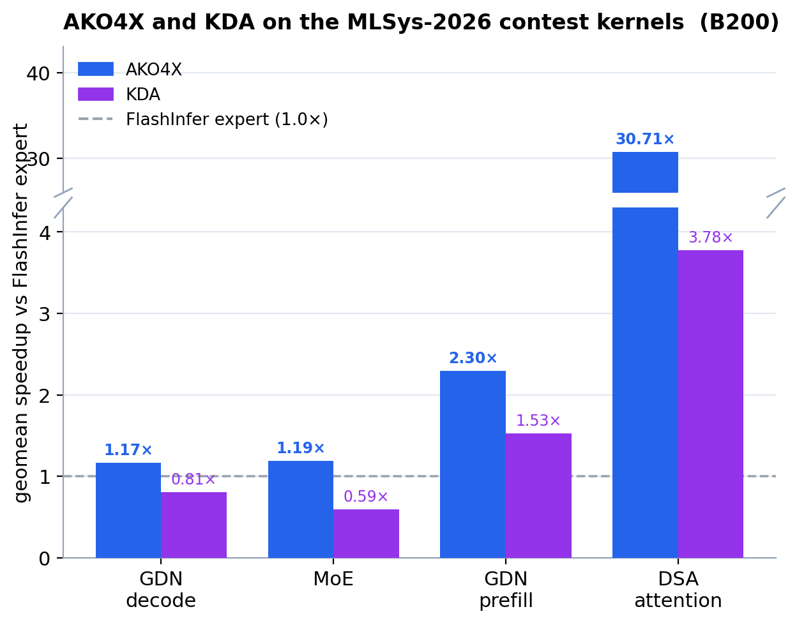
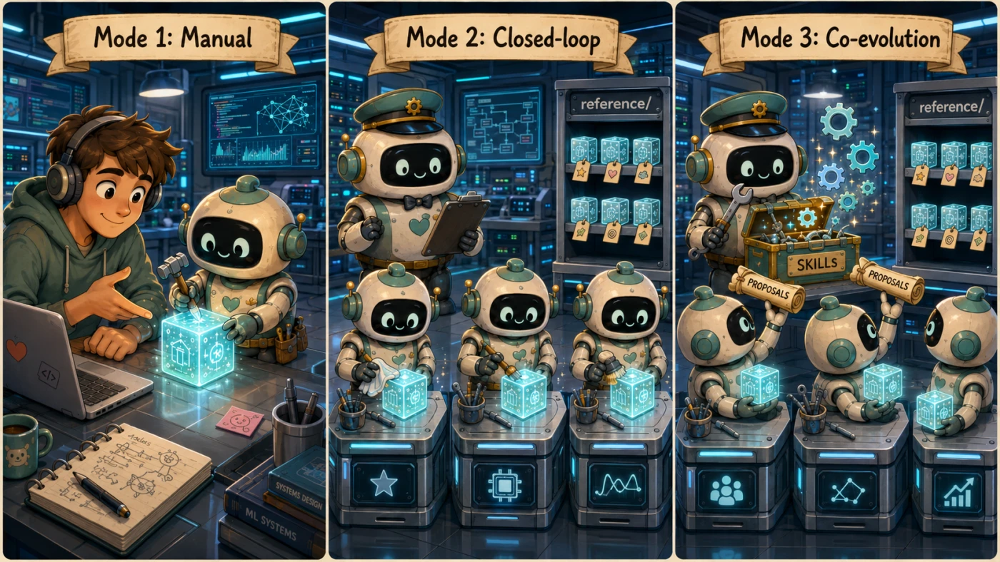

<h1 align="center">AKO4X</h1>
<p align="center"><b>Agentic Kernel Optimization — advanced & eXtensible</b></p>

<p align="center">
  <a href="https://tongminglaic.github.io/AKO"></a>
  <a href="https://github.com/TongmingLAIC/AKO4ALL"></a>
  <a href="https://tongminglaic.github.io/AKO/assets/ako-tech-report.pdf"></a>
</p>

<p align="center"><b>If you find our work useful, please consider giving us a star 🌟</b></p>

<p align="center">
  
  <br/>
  <i>Geomean speedup over the FlashInfer <b>expert</b> on the 5 MLSys-2026 contest kernels (NVIDIA B200) — AKO4X clears the expert by up to 30.71× on DSA sparse attention, and stays ahead of the concurrent <a href="https://github.com/mit-han-lab/kernel-design-agents">KDA</a> submission on all five. Full breakdown in <a href="#results">Results</a>.</i>
</p>

## News

- 📄 **[2026.05.31]** The **[AKO tech report](https://tongminglaic.github.io/AKO/assets/ako-tech-report.pdf)** is now available.
- 🚀 **[2026.05.31]** **AKO4X** is now open-source — the closed-loop, campaign-based system behind our [MLSys 2026 competition](https://mlsys26.flashinfer.ai/) entry.
- ✨ **[2026.05.31]** [**AKO4ALL**](https://github.com/TongmingLAIC/AKO4ALL) is now a single drop-in [Claude Code](https://docs.anthropic.com/en/docs/claude-code) skill — invoke it in any working directory.
- 🚀 **[2026.03.24]** [AKO4ALL](https://github.com/TongmingLAIC/AKO4ALL) is released.

**Table of Contents**

- [What is AKO4X?](#what-is-ako4x)
- [System Overview](#system-overview)
- [Three Operating Modes](#three-operating-modes)
- [Quick Start](#quick-start)
- [Core Features](#core-features)
- [Default Benchmark: flashinfer-bench](#default-benchmark-flashinfer-bench)
- [Results](#results)
- [Documentation](#documentation)
- [Tech Report](#tech-report)
- [Contributing](#contributing)
- [Acknowledgments](#acknowledgments)
- [License](#license)

## What is AKO4X?

**AKO4X is an agent-driven framework for optimizing GPU kernels.** Point it at a kernel operator (e.g. an attention or gemm shape), and it spawns a fresh, isolated workspace where Codex or Claude iterates on the kernel using the tools, profilers, and per-DSL knowledge AKO4X provides.

Use it as a **single session** — spawn one workspace, let the agent optimize, you're done. Or run a **multi-round campaign** — a persistent master agent autonomously spawns rounds back-to-back, archives each round's best variant, and uses the growing archive to seed the next round.

**The "X" carries two meanings.** *Advanced* — AKO4X is more capable than its plug-and-play sibling [AKO4ALL](https://github.com/TongmingLAIC/AKO4ALL): three operating modes, pluggable SKILLs, optional harness co-evolution. *eXtensible* — three layers of AKO4X are designed to be swapped or extended:

- the **benchmark** that scores the agent's kernels (default: [flashinfer-bench](https://github.com/flashinfer-ai/flashinfer-bench); swap via [docs/porting.md](docs/porting.md))
- the **SKILLs** layer — per-DSL knowledge and tool wrappers the agent loads on demand (drop a folder under `templates/skills/`)
- **the harness itself** — in Mode 3 the agent proposes improvements to its own templates and tooling each round, and the master gates them in.

The first two AKO4ALL can do too; the third is what makes AKO4X the *advanced* variant.

<p align="center">
  
</p>

**AKO4X vs [AKO4ALL](https://github.com/TongmingLAIC/AKO4ALL) — where they differ:**

- **Form:** AKO4ALL is a single Claude Code skill that runs in place in your working directory. AKO4X is a template repo that spawns a fresh isolated workspace per run.
- **Cross-run memory:** AKO4ALL doesn't carry memory between runs on the same kernel. AKO4X (in closed-loop modes) accumulates a per-operator archive across rounds, so the Nth round is informed by earlier ones.
- **Agent-driven harness changes:** AKO4ALL's skill is fixed — what you put in the workspace (kernel, `HINTS.md`, optional bench / reference) drives each run, but the skill itself doesn't change. AKO4X (Mode 3) lets the agent propose harness changes after each round, which the master gates and applies.

AKO4ALL is the simplest path — install the skill once, drop in a kernel, go. AKO4X gives that up for the differences above. **Pick AKO4X even for a single kernel** if any of those matter to you.

## System Overview

<p align="center">
  
</p>

The top strip traces one closed-loop campaign round: the master picks a parent, spawns a child env, the sub agent optimizes a kernel, and the variant gets archived (feeding the next round). The stack below shows what the sub agent actually runs on — a **Generic Agent Substrate** supplied by Codex or Claude (agent loop, context, tool use), plus the **Kernel-Specific Harness** AKO4X layers on top: a task template, a cross-session reference archive, and a SKILL catalog the sub progressively loads from. The harness layer is where AKO4X's value sits — when you extend or port the framework, the pieces you touch live in `(b)`, and you only touch the ones relevant to your change (a benchmark swap, a new DSL SKILL, etc.). How you actually drive this loop depends on the mode you pick — covered next.

## Three Operating Modes

AKO supports three ways to drive an optimization session. Pick by how much autonomy you want:

- **Mode 1 — Manual.** Single spawn, one session. `spawn.py` creates one child environment; you `cd` in, run the selected agent, and give it an initial prompt — the agent then iterates on the kernel itself within that session. You can stay hands-off, chime in occasionally, or pair-program closely — your call. Simplest path; covered in [Quick Start](#quick-start) below.
- **Mode 2 — Closed-loop (default).** You start a persistent **master agent**; it autonomously spawns a fresh child env each round, launches a **sub agent** inside, frames the round with a high-level prompt (direction, not micro-instructions), collects the resulting kernel and metrics, archives the variant into `reference/<family>/` (one archive directory per operator — `family` is the kebab-case operator name; see [Closed-loop campaigns](docs/closed-loop.md)), and uses that variant plus prior-round lessons to steer the next round's parent selection and prompt. The harness (templates, scripts, SKILLs) stays static — only kernels evolve.
- **Mode 3 — Closed-loop + harness co-evolution (opt-in).** **Mode 2 plus** a phase-2 retrospective: after each successful kernel round, the sub additionally writes harness improvement proposals to `PROPOSALS.md`. The master evidence-gates them and applies accepted edits to `templates/skills/` etc. Both kernels and the agent's knowledge/tooling evolve across rounds.

<p align="center">
  
</p>

For Mode 2 / Mode 3 setup, see [Closed-loop campaigns](docs/closed-loop.md).

## Quick Start

> The commands below run **Mode 1** with the default benchmark (flashinfer-bench). For other benchmarks see [Porting](docs/porting.md); for closed-loop modes see [Closed-loop campaigns](docs/closed-loop.md).

```bash
# Install
pip install .

# Download a dataset (LFS pointers only — tensors are fetched on demand)
GIT_LFS_SKIP_SMUDGE=1 git clone https://huggingface.co/datasets/flashinfer-ai/flashinfer-trace
export AKO_DATASET_PATH=/path/to/flashinfer-trace   # FIB_DATASET_PATH also works

# Spawn an optimization environment
python spawn.py --operator dsa_sparse_attention_h16_ckv512_kpe64_topk2048_ps64 \
  --name my_run --agent codex

# Enter the child environment and start optimizing
cd ../ako4x-run-my_run
codex
# Send your initial prompt, e.g. "Optimize this kernel using Triton"
```

> **The default benchmark (flashinfer-bench) requires CUDA Driver >= 13.0.** Check with `nvidia-smi`. See [Installation](docs/installation.md) for prerequisites, optional extras, and verification steps.

A few extras worth knowing about in Mode 1: you can seed a non-default starting kernel with `--kernel /path/to/kernel`. Everything else is **recorded for you as you go** — the agent writes one Summary row per labeled bench into `ITERATIONS.md`, `scripts/bench.sh` snapshots every labeled run into `trajectory/`, and `git log` is your iteration history.

For production-focused work in any repository, initialize the strict supervisor:

```bash
ako4x-lab init .
# Configure .ako4x/production.toml, then:
ako4x-lab doctor --config .ako4x/production.toml
```

The production profile requires real parsed NCU and NSYS reports, numerical and
training-integration tests, concurrency/lifetime/deployment gates, and an exact
source hash before promotion. It also supports concurrent isolated hands-on and
autonomous lanes. See [Production kernel campaigns](docs/production.md).

## Core Features

AKO is deliberately small at the system layer. Three things make it distinctive:

- **Swappable benchmark.** Every call into the benchmark goes through a single seam, `scripts/benchmark_adapter.py`, exposing plain-data functions (`run` / `pack` / `solution_meta` / `list_workloads`, plus optional `profile` / `list_ncu_options` / `sanitize` / `cheat_check`). The contract is **derived from flashinfer-bench**: ports adapt their native shape to AKO's at the adapter and, when the dataset layout differs, at a spawn-time transform on the `spawn.py` side (a flat-pyfile benchmark like KernelBench, for example, would need ~80 lines of `spawn.py`-side code to materialize an AKO-shaped `definitions/` + `workloads/` tree from the source). Once those two are in place, `bench_utils.py` scoring math, the runners, and the DSL skills work untouched — they only ever see `str` / `list[str]` / `dict`. Step-by-step in the [porting guide](docs/porting.md).
- **Progressive-disclosure SKILLs you can extend.** Per-DSL knowledge, benchmark contracts, and tool wrappers live under `templates/skills/<name>/SKILL.md`. At spawn time the subtree is copied into the selected agent's native directory (`.agents/skills/` for Codex, `.claude/skills/` for Claude). Production lanes additionally materialize KDA's `KernelWiki` and `ncu-report-skill` plus `cuda-kernel-style` verbatim, with provenance hashes. **Adding your own SKILL = drop a folder under `templates/skills/`** — it ships with every spawn from then on.
- **Closed-loop with cross-round memory and audit trail (experimental).** Multi-round campaigns accumulate per-operator memory in `reference/<family>/`: working variants (each with a `kernel.py` header carrying Identity / Delta / Lessons / Dead-ends), a frozen baseline, the current anchor pointer, a `TRAPS.md` silent-bug catalog, and failed-round transcripts. Every master decision lands in append-only `master/harness-ledger.md`. A small FROZEN scope (task identity + the active benchmark's scoring/baseline) is enforced by the master step-7 gate, so cross-round comparability isn't broken by accident. See [Closed-loop campaigns](docs/closed-loop.md).

## Default Benchmark: flashinfer-bench

AKO ships pre-wired to [flashinfer-bench](https://github.com/flashinfer-ai/flashinfer-bench) as the default benchmark. With this wiring you get:

- **6 kernel languages** out-of-the-box: Python/PyTorch, Triton, CUDA, C++, TileLang, CuTe DSL — each covered by a matching SKILL under `templates/skills/`. The agent picks one, or you steer it via your initial prompt.
- **Local GPU + Modal (cloud GPU)** execution backends via `--backend local|modal`.
- **NCU (NVIDIA Nsight Compute) profiling + compute-sanitizer** wrappers for bottleneck analysis and correctness debugging.
- **Custom operators** via flashinfer-bench's [BYO-kernel format](https://bench.flashinfer.ai/docs/tutorials/bring-your-own-kernel) — point `--dataset` at your own trace set.

Most pages under [`docs/`](docs/) document AKO's behavior **assuming this default**; sections that depend on flashinfer-bench specifics are explicitly marked. To swap in a different benchmark see [docs/porting.md](docs/porting.md) — the porting guide walks through the small, named swap surface and the leakages it carries.

## Results

<details>
<summary><b>Beats the FlashInfer expert by up to 30.7× on the MLSys-2026 contest kernels, and ahead of the concurrent KDA submission on all five.</b></summary>

<br>

AKO4X driving Claude Code (**Claude Opus 4.7**, 1M context, max thinking effort) produces **expert-competitive kernels across 10 FlashInfer-Bench operator families** on **NVIDIA B200** — five MLSys-2026 contest kernels plus five more. Every number below is **speedup over the FlashInfer _expert_ baseline** — the strongest hand-tuned kernel FlashInfer ships, profiled once per operator with the same runner as our kernels. All workloads pass correctness; we report the **geomean** and keep honest negatives.

### AKO4X and KDA on the 5 MLSys-2026 contest kernels

On the five [MLSys-2026 contest](https://mlsys26.flashinfer.ai/) kernels we re-measure both AKO4X and the concurrent **[KDA](https://github.com/mit-han-lab/kernel-design-agents)** submission (HAN Lab Kernel Mafia) under one identical B200 harness, against the same FlashInfer expert. AKO4X clears the expert on every kernel that *has* an expert baseline and stays ahead of KDA on all five, while KDA itself drops below the expert on MoE and GDN-decode.

| Kernel | Workloads | AKO4X (vs expert) | KDA (vs expert) |
|---|---|---|---|
| DSA sparse attention | 23 | **30.71×** | 3.78× |
| GDN prefill | 100 | **2.30×** | 1.53× |
| MoE fp8 block-scale | 19 | **1.19×** | 0.59× |
| GDN decode | 54 | **1.17×** | 0.81× |
| DSA top-k indexer&nbsp;**†** | 128 | **1.27× faster than KDA** | — (baseline-free) |

Geomean speedup over the FlashInfer **expert**; every workload passes correctness (19–128 per kernel). **†** The DSA top-k indexer also beats the expert (measured in the original contest run); the FlashInfer-DeepGEMM reference fails to run on cu132, so here it's a baseline-free **latency** comparison: AKO4X **1.27× faster** than KDA (0.0053&nbsp;ms vs 0.0067&nbsp;ms).

### Breadth: 5 more families vs the FlashInfer expert

Beyond the contest set, AKO4X clears the expert in geomean on every breadth family except GEMM. The advantage is **regime-aware, not uniform** — small-batch / launch-bound shapes win biggest, large traffic-bound shapes regress toward (and occasionally below) the expert, as the min–max ranges show. GEMM ties cuBLAS — an honest negative we keep, not a win we claim.

| Kernel | Workloads | AKO4X geomean | range (min–max) |
|---|---|---|---|
| GQA paged decode (h32, kv8, d128) | 48 | **1.43×** | 0.85–1.81 |
| MLA paged decode (h16) | 47 | **1.42×** | 0.84–1.98 |
| MLA paged prefill (causal, h16) | 38 | **1.36×** | 0.82–2.37 |
| RMSNorm (h=128) | 14 | **1.14×** | 0.96–1.67 |
| GEMM (n=2048, k=4096) | 29 | 1.00× | cuBLAS unbeaten (campaign closed) |

Every kernel above — together with its full optimization trajectory (per-round variants, lineage, lessons, and dead-ends) — is archived under [`reference/`](reference/), one directory per operator, each with a `README.md` anchor pointing to the best variant. Raw per-workload measurements are released with the [tech report](#tech-report).

</details>

## Documentation

| Guide | What it covers |
|-------|---------------|
| [Installation](docs/installation.md) | Install + first spawn + working with the agent |
| [Closed-loop campaigns](docs/closed-loop.md) | Autonomous multi-round optimization (Mode 2 / Mode 3) + family-archive lifecycle |
| [Production kernel campaigns](docs/production.md) | Codex/Claude lanes, mandatory NCU+NSYS evidence, production gates, telemetry, and promotion |
| [Porting to another benchmark](docs/porting.md) | Swap FlashInfer-Bench for a different benchmark — the adapter seam + swap checklist |
| [Troubleshooting](docs/troubleshooting.md) | flashinfer-bench-specific issues (CUPTI driver mismatch, version pinning, TVM FFI linking) |

**Docs philosophy.** These pages are **agent-friendly by design** —
terse, code-referenced, focused on *why* and *when* rather than
enumerating *what*. Operating-time knowledge intentionally lives in the
code (`spawn.py` generates the child env and its `config.toml`;
`scripts/bench_utils.py` owns runtime behavior) and in the
progressive-disclosure SKILLs at `templates/skills/`, not duplicated
here. Since using this repo already requires a coding agent, **the
intended way to read this repo is to point your agent at it and ask** —
"explain how `spawn.py` wires up the child env", "what fields does
`config.toml` take", "what does the `bench` SKILL describe". That beats
any reference table we could maintain, and it's why we don't try to.

## Tech Report

The **[AKO tech report](https://tongminglaic.github.io/AKO/assets/ako-tech-report.pdf)** is now available.

## Contributing

We welcome contributions! For architecture details and development guidance, see [CLAUDE.md](CLAUDE.md).

**Roadmap:**

- **Capability-adaptive harness — proposals that reshape, not just append.** Honestly, the current proposal mechanism isn't good enough yet. The master is reactive-only (it gates and applies sub's phase-2 proposals but never proposes its own), and even that reactive channel is structurally biased toward *append*: sub-side framing is "what was missing", so proposals tend to grow SKILL docs rather than reshape them, and the harness slowly bloats. The real target is a proposal mechanism that **adapts the harness to the model's actual capability** — adding scaffolding when the model needs it, *removing* instructions when it doesn't (stronger models need less hand-holding, not more). Two near-term steps in this direction: (a) a master self-proposal channel gated on cross-round failure patterns the per-round sub view can't see; (b) lifting the structural append bias in the proposal contract (today partially patched in MASTER.md by an SKILL-hygiene gate + supersession gate, but those are workarounds, not the right shape). Ultimately gated on general model capability — a model that can robustly judge "load-bearing vs noise" in long-running SKILL docs is the prerequisite.
- **Parallel sub agents per round** — currently the master spawns one sub per round and blocks until it finishes; rounds run strictly serially. Future: fan out N subs concurrently within a round (different parents, different framings of the same problem, competing DSLs) and aggregate before archiving — multiplies campaign throughput on parallel compute (Modal / multi-GPU local).
- **Cross-operator variant sharing within a kernel class** — currently every operator gets its own fully-isolated `reference/<operator>/` archive, so a new operator in the same kernel class always restarts from the PyTorch reference. Future: kernel-class-level shared lessons + opt-in sibling-anchor warm-starting.

Check [open issues](../../issues) for specific tasks, or open a new one to discuss your ideas.

## Acknowledgments

We would like to thank the following open-source projects that inspired and supported the development of AKO:

- [FlashInfer](https://flashinfer.ai/) — for the LLM inference kernel library and the [flashinfer-bench](https://github.com/flashinfer-ai/flashinfer-bench) benchmark infrastructure AKO4X ships on as its default benchmark.
- [autoresearch](https://github.com/karpathy/autoresearch) and [autokernel](https://github.com/RightNow-AI/autokernel) — AKO's design was inspired by their work on autonomous optimization loops.

We also thank [Modal](https://modal.com/) for the GPU credits that powered our [MLSys 2026 competition](https://mlsys26.flashinfer.ai/) runs.

## Citation

If you find AKO useful, please cite:

```bibtex
@misc{ako2026,
  title        = {{AKO}: Agentic Kernel Optimization},
  author       = {Shuxiao Xie and Shuyang Xie and Dezhi Ran and Wei Yang and Tao Xie},
  year         = {2026},
  howpublished = {\url{https://tongminglaic.github.io/AKO}},
  note         = {Technical report}
}
```

## License

This project is licensed under the [MIT License](LICENSE).
